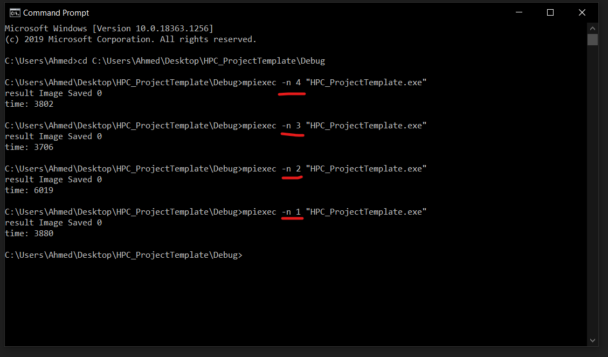

# Parallel-Low-Pass-Filter
## Description:
- It is used to make images appear smoother. 
- Low pass filtering smooths out noise. 
- It allows low frequency components of the image to pass through and blocks high frequencies.
- Low pass image filters work by convolution which is a process of making each pixel of an image by a fixed size kernel.

## system Photos :

## Note : To work you should use command line as photo.
